## **Getting Started with Fusion 360: Create an Autodesk Account**
Install **Fusion 360 and enjoy the 1-year student license.**

**Link: [**Autodesk Student Access to Education Downloads**](https://www.autodesk.com/education/edu-software/overview?sorting=featured&filters=individual)**

First things first: Do not download that 30-day trial. 
#### The Quick Setup:
 **Create the account:** Go to the official Autodesk education site. You need to create an account there.  Write your basic info—email, name, password.

  

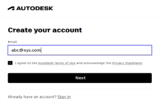

**Proof of studentship:**

1. Scroll to the **All Products** section and select Fusion 360.

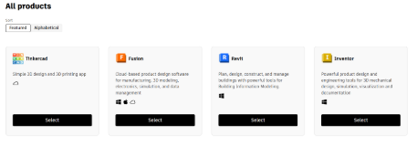

  
2. Select a subscription plan as a student.

  
3. Fill up the form & obviously provide the right information. Upload the ID card and submit the form.
   

 **Download and install:** Once you have that confirmation, go to the Fusion 360 page and click the "Get Product" button. Download the file, run it, and let the program install itself. 

 **Final setup:** When you open the program for the first time, it'll ask you about setting up a "Team." Give your team a random name and click OK.

## Setting Up Preferences (Units, Grid, Theme)

### **1. Default Units (for all new designs)**
1. Click your **profile icon** (top-right) → **Preferences**.
2. Open **Default Units → Design**.
3. Choose your unit system (**mm**, **cm**, **inch**, etc.).

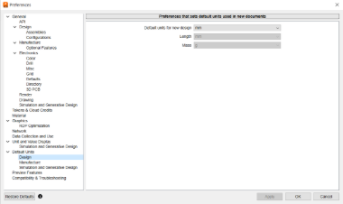

4. Confirm to apply.
*This will be the unit for every new file you create.*

-----
### 2. Units for the Current File

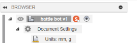

1. In the **Browser** (left), open **Document Settings**.
2. Click the small **Units** icon beside it.
3. Select the preferred unit and confirm.
   *Only this file will switch to the new unit.*

-----
### **3. Grid Settings**

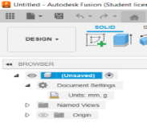

1. Bottom toolbar → **Grids & Snaps**.
1. Select **Grid Settings**.
1. Adjust **grid spacing**, or turn the **grid/snap** on or off.
*Useful for sketch accuracy and visual alignment.*

-----
## **Understanding The Interface**
- ## Toolbar
**(The strip at the highest)**

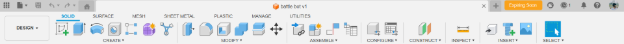

This is just your tool collection, you know? It’s got all the buttons. Drawing stuff, building stuff—it’s all there. And it's cool because it basically reads your mind; if you switch to a different task, the whole strip of tools switches automatically. Like, poof, new tools.

-----
##
- ## Browser Panel

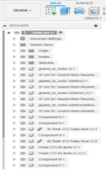

**(The vertical list on the left)**

Okay, so you build stuff, right? This list is your running list of literally everything you've made. Every single line, every bolt, every little block. If your design gets crazy busy, this list is how you find that one piece you need to hide or maybe rename it so you don't forget what it is. It's your project inventory.

-----
- ## **Canvas Area**
**(The large space)**

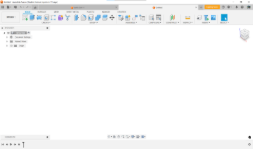

Well, this is the main spot. Your digital desk. Everything you build—that’s where it lives. This is where all the action and the fun happen. You see your work right here.

-----
- ## **ViewCube**

**(The small box, top right)**

I call this the camera holder. You click it to look at the top, or the front, or whatever. Or you can just grab it and spin the whole model around with your mouse, like you're holding it up in the air. Easy way to look at the back side.

-----
- ## **Navigation Bar**

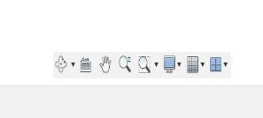

**(Down below that box)**

These are just the controls for your view. They let you slide the picture around, or zoom way in on a tiny detail, or spin the model slowly. They also have buttons to change how the model looks—like shiny or clear or whatever you need.

-----
##
- ## **Timeline**
**(The bar way down at the bottom)**
This thing is awesome. It's your undo history on steroids. Every single action is recorded here. If you did something ten steps ago and realized it was wrong, you jump back, fix only that one thing, and everything else you built snaps into place correctly. It's the master editor.

-----
- ## **Data Panel**
**(The button top-left)**
This just opens up your folder system. It's where all your saved designs and projects live. Click it, find your file, and open it. Super simple filing cabinet.

-----

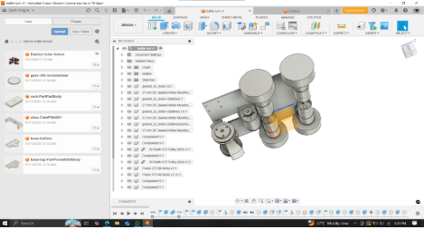

---

## **2. 3D Modification**
These tools help you smooth out rough spots, hollow out parts, or change the overall size.

### 2.1 ** Fillet:** **Rounds off** a sharp edge or corner. 

*You select the edge and set the curve's **radius**.

-----

### 2.2 ** Chamfer:** **Cuts a flat angle** on a sharp edge instead of rounding it.

*You set the value to chamfer of the edge.

-----

### 2.3 **** Shell: **Makes a solid part hollow**, like a plastic bottle.

*You pick the faces you want to remove to create the opening and set the **wall thickness**.

-----

### 2.4 ** Scale:** Makes the entire object bigger or smaller by multiplying its size by a **scale factor**.

* It Has been .5 smaller than the previous size.

-----

### 2.5 ** Combine:** **Merges** two or more solid parts into a single body. You choose whether to **join** (add), **cut** (subtract), or **intersect** them.

* Two Different Object.

* Select two object to combine then press okay. Selected Two Objects are Combined.

### 2.6 ** Split:** Uses a **face or plane** like a knife to cut one solid body into two or more separate pieces.

* Select the Body and the plane to slpit the body. You can create custom plane in **Constraction Line** later.

-----

## 3.0 **Moving Things**

 ### 3.1 **Move:** Shifts or rotates an object along the **X, Y, or Z directions** by specific amounts.

<table align="center">
  <tr>
    <td align="center" valign="bottom">
      
       
      <b>Step 1: Select the Body</b>
    </td>
  </tr>

  <tr>
    <td align="center" valign="bottom">
      
       
      <b>Step 2: Set X = 50mm</b>
    </td>
  </tr>

  <tr>
    <td align="center" valign="bottom">
      
       
      <b>Step 3: Set Y = 30mm</b>
    </td>
  </tr>
</table>

* Select the object and specify the X, Y, Z values to move the Object.

-----

### 3.2 **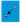 Point-to-Point Move:** A fast way to move. You pick one **point on the object**, and then pick the exact **spot in space** where you want that point to end up.

* If i want to move one object to another by this point then Run The **Move** command and Select **Point to Point**.

* Selected the object and the two points.

* Click Okay to move the object **Point to Point**

-----

### 3.3 ** Pivot:** This lets you temporarily set a custom **center point** (**pivot**) for rotation, so you can spin the object around a specific spot.

* Run the **Move** command and select the **Pivot** command.

* Now Move the pivot and click the **Check Mark** beside pivot. (Mandatory), then press **Ok**

* Now the Object will move by its new pivot point

-----

## 4.0 **Assembly & Joints**

Joints tell the software how separate components should interact and move together.

### 4.1 ** Joint Tool:** You pick **snap points** (like corners or center spots) on the two parts you want to connect.
**Joint Types: Click on the Tab “Motion”**
  ** Rigid:** **Locks** the parts together completely—they can't move at all.

 

  
  

  * Select two snap points of the components and connect them. Press "Ok"

-----

### 4.2 ** Revolute (Spin) & Slider (Slide):** These allow movement. You need to set the **Minimum** and **Maximum** positions to limit how far the part can spin or slide.
  

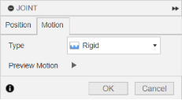

  * Select the joint type from motion. 

  

 
  

 * **Preview:** Always use the motion **preview** to watch the joint work and make sure it's doing what you expect!
 * 
-----

### 5.0 **Construction Tools**
These tools create things that aren't part of the final product (like planes or lines) but help you sketch or build features on complicated parts.

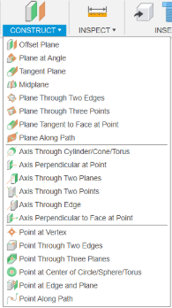

### 5.1 ** Offset Plane:** Makes a new plane that is **parallel** to an existing surface, just moved by a certain **distance**.

* Select the **Offset Plane** commant and select the face of the object to make the offset plane. Specify the distance of the plane. Click "ok"

-----

### 5.2 ** Plane on the Edge:** Selects a straight **edge** and creates a plane rotated off that edge by a specific **angle**.

* Select the **Plane on the Edge** commant and select the edge of the object to make the plane. Specify the angle of the plane. Click "ok" .

-----

### 5.3 ** Mid Plane:** Creates a plane exactly **in the middle** of two selected faces.

* Select the ** MidPlane** command and select the Opposit two face of the object to make the plane. Click "ok" . There will be the plane right between the object.
  
* **Quick tips:**You split the object by creating the mid plane first and get the object divided into two parts.

-----

### 5.4 ** Tangent Plane:** Creates a plane that just **touches** a curved surface (like a **cylinder**) without going inside it.

* Select the ** Tanget Plane** commant and select the round face of the object to make the plane. Specify the angle of the plane. Click "ok" .
* There's a option name **Reference Plane** for now we don't need that.

-----
